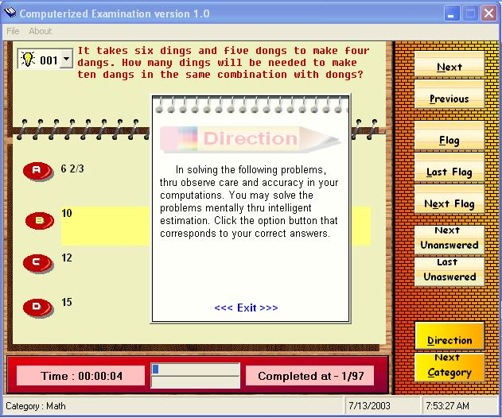



## Computerized Examination 7/13/2003

### Description

My first sent seems not working, so am sending this program again. and This program has a very nice graphic design. All questions and options are randomized. You can add as many categories as you like (the program will automatically read all the categories)...and more.
 
### More Info
 

             |
---                |---
**Submitted On**   |2003-07-13 07:49:24
**By**             |[Aries Buenaventura](https://github.com/Planet-Source-Code/PSCIndex/blob/master/ByAuthor/aries-buenaventura.md)
**Level**          |Intermediate
**User Rating**    |5.0 (25 globes from 5 users)
**Compatibility**  |VB 5\.0, VB 6\.0
**Category**       |[Complete Applications](https://github.com/Planet-Source-Code/PSCIndex/blob/master/ByCategory/complete-applications__1-27.md)
**World**          |[Visual Basic](https://github.com/Planet-Source-Code/PSCIndex/blob/master/ByWorld/visual-basic.md)
**Archive File**   |[Computeriz1613767132003\.zip](https://github.com/Planet-Source-Code/aries-buenaventura-computerized-examination-7-13-2003__1-46867/archive/master.zip)

